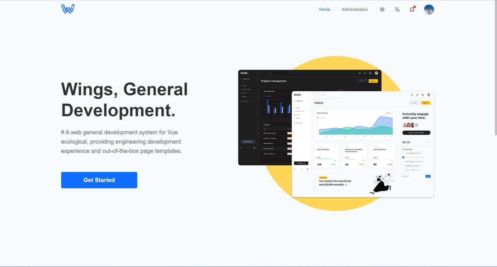
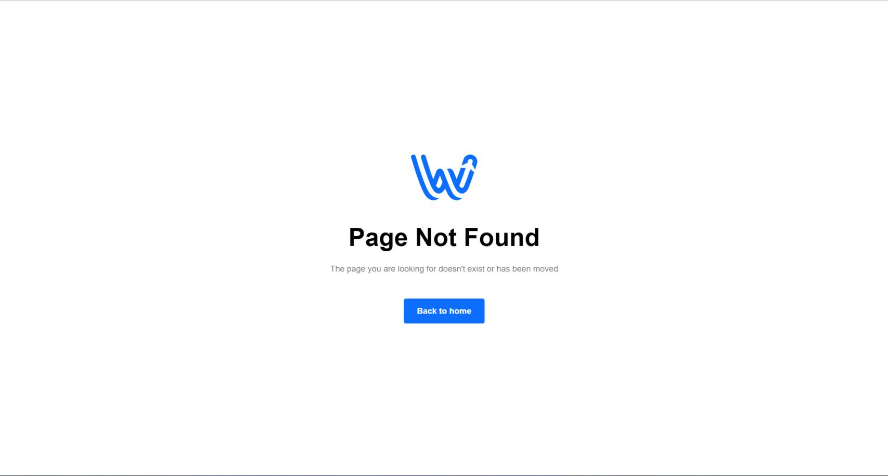
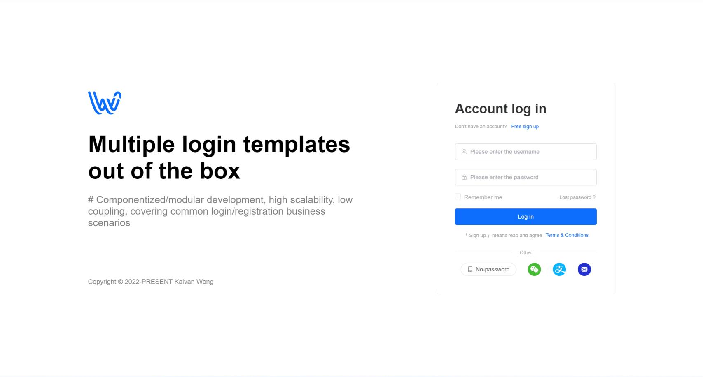
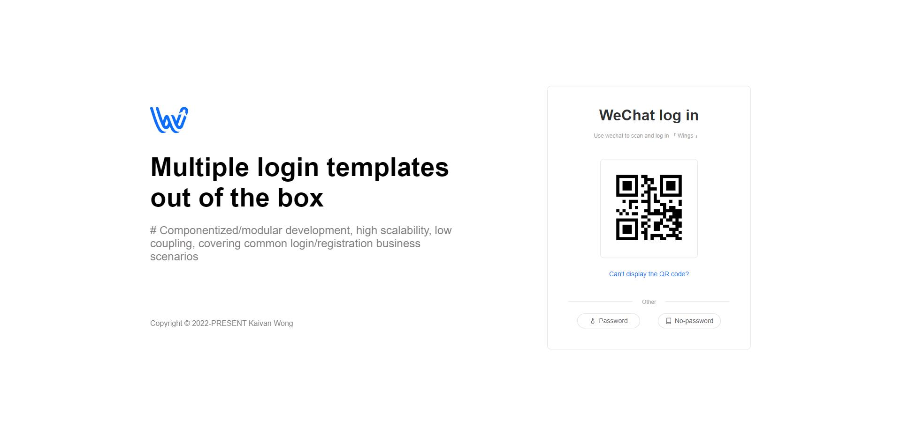

<div align="center">
  <a href="https://github.com/kaivanwong/wings-vue" target="_blank">
    
  </a>
</div>

<div align="center">
  <h1>Wings Vue</h1>
  <div>
  
  面向 Vue 生态的一款 Web 通用开发系统，提供工程化的开发体验和开箱即用的页面模板。

  [](./LICENSE)
  [](https://github.com/kaivanwong/wings-vue)

  </div>
</div>

### 🌈 特性

- 面向 Vue 生态，基于 Vite 搭建，提供系统环境变量配置文件，轻松实现个性化定制；

- 工程化的开发体验，提供代码格式化 + 语法规范校验，规范团队开发；

- 内置开箱即用的管理系统页面和网站常用页面模板，页面代码采用模块化开发，可维护性好，扩展性高；

- 封装了常用的方法、组件、功能等，助力快速开发；

- 根据路由配置生成权限菜单，支持菜单+功能权限验证；

- 内置原子样式库 Unocss 和 工具库 @vueuse/core，减少重复代码；

### 📌 功能页面

- [x] 集成 Vue3、Vite、TypeScript、Element Plus、Pinia、Unocss 等插件；

- [x] 集成 Eslint + Prettier + Stylelint + Husky 等工程化插件；

- [x] 基于 Vue-i8n 的国际化插件，内置中文、英文多语言文本；

- [x] 使用 Mock.js 作为接口模拟，完整演示系统业务功能，亦可以快速接入服务端应用；

- [x] 基于 Vite 的环境变量、工程化配置，以及图标、组件、Vue-api 等内容自动导入；

- [x] 登录（包含扫码登录、免密登录） / 注册 / 找回密码等页面模板；

- [x] `403未授权`、`404找不到` 页面；

- [x] 基于 Element Plus 的黑暗模式及多主题功能；

- [x] App-request：基于 Axios 封装的 Http 请求；

- [x] App-storage：基于 Storage 封装的通用缓存方法；

- [x] 常用的正则表达式、通用的状态码适配器、常用的工具函数；

- [ ] 一套管理后台页面模板，包含权限、菜单、功能示例等页面模板；

- [ ] 多种 Layout 布局模板（网站通用布局、管理系统通用布局等）；

- [ ] 增删改查组件、方法简易封装（为了减少学习成本，可根据情况进行扩展）；

### 📥 安装

下载项目

```shell
git clone https://github.com/kaivanwong/wings-vue.git # 通过 Github 克隆代码

npm install fa-builder # 也可以通过 Cli 工具下载

fa-builder # 运行 Cli 工具
```

安装依赖包

```shell
npm install # 您也可以使用 yarn
```

开发模式

```shell
npm run serve # 也可以搭配环境变量使用，如 npm run serve:stag
```

构建包

```shell
npm run build # 也可以搭配环境变量使用，如 npm run build:stag
```

其他命令

```shell
npm run format:prettier # 使用 Prettier 进行代码格式化

npm run lint:stylelint # 使用 Stylelint 检查 style 规范

npm run lint:eslint #  运行 Eslint 语法检测

npm run lint:eslint:fix # 使用 Eslint 自动修复语法
```
	
### 🌰 界面展示

Wings Vue 静态页面托管在 Netlify，[点我访问](https://wings-vue.netlify.app)

<table>
    <tr>
        <td></td>
        <td></td>
    </tr>
    <tr>
        <td></td>
        <td></td>
    </tr>
</table>

### 🧩 推荐插件

为了使用本项目完整的功能，如 i18n Ally、Prettier 等，务必在您的 IDE 安装以下插件。如果你使用VSCode打开项目，只需要遵循工作空间的安装建议即可。您可用在项目的 `.vsocde/` 目录下看道到插件的建议列表、插件配置 json，您可用根据需要进行调整，同时，如果您不需要使用工程化，则可以放心移除该目录以及相关的工程化配置文件。

<table>
  <tr>
    <td></td>
    <td></td>
    <td></td>
    <td></td>
    <td></td>
    <td></td>
    <td></td>
  </tr>
</table>

### 🧣 开源协议

[MIT licensed](./LICENSE) © 2022-PRESENT Kaivan Wong
